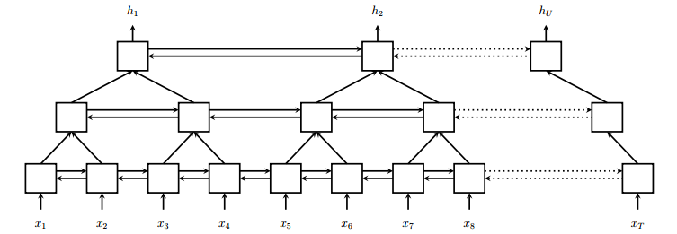
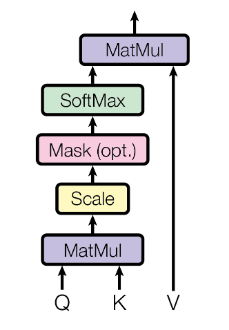
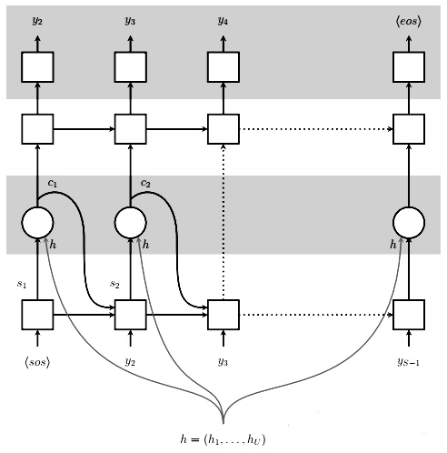

# Attention-based End-to-End Speech Transcription

## About

> This is a course project from CMU 11-785 Introduction to deep learning. 

This project is to design a model for end-to-end speech transcription. In short, I use a combination of Recurrent Neural Networks (RNNs) / Convolutional Neural Networks (CNNs) and Dense Networks to design a system for speech to text transcription. End-to-end, the system transcribes a given speech utterance to its corresponding transcript. To this end, I reimplement [Listen, Attend and Spell](https://arxiv.org/pdf/1508.01211.pdf). All credits of this project goes to the author of this paper. 


## Table of Contents
* [Overview](#overview)
* [Approach](#approach)
* [Key Learnings](#key-learnings)
* [Installation](#installation)
* [Usage](#usage)

## Overview

First, let's review some concepts and metrices in the language processing:

### Utterance

As a first step, the speech (audio file) must be converted into a feature representation that can be fed into the network. In our representation, utterances have been converted to "mel-spectrograms", which are pictorial representations that characterize how the frequency content of the signal varies with time. The frequency domain of the audio signal provides more useful features for distinguishing phonemes. To convert the speech to a mel-spectrogram, it is segmented into little "frames", each 25ms wide, where the "stride" between adjacent frames is 10ms. Thus we get 100 such frames per second of speech. From each frame, a single "mel spectral" vector is computed, where the components of the vector represent the (log) energy in the signal in different frequency bands. In the data of this project, the band_width is set to 40. Thus, we get 100 40-dimensional mel spectral (row) vectors per second of speech in the recording. Each one of these vectors is referred to as a frame. 

### Phonemes
As letters are the atomic elements of written language, phonemes are the atomic elements of speech. For example, we consider 46 phonemes in the english language: ["+BREATH+", "+COUGH+", "+NOISE+", "+SMACK+", "+UH+", "+UM+", "AA", "AE", "AH", "AO", "AW", "AY", "B", "CH", "D", "DH", "EH", "ER", "EY", "F", "G", "HH", "IH", "IY", "JH", "K", "L", "M", "N", "NG", "OW", "OY", "P", "R", "S", "SH", "SIL", "T", "TH", "UH", "UW", "V", "W", "Y", "Z", "ZH"]. Some approaches first learn to match frames to phonemes, and then use the phonemes to predict transcripts. However, this project skips this step and directly transcribe from the utterances.

### Levenshtein Distance
Levenshtein distance is a string metric for measuring the difference between two sequences. Informally, the Levenshtein distance between two words is the minimum number of single-character edits (insertions, deletions or substitutions) required to change one word into the other.

## Approach

The model is adapted from [Listen, Attend and Spell](https://arxiv.org/pdf/1508.01211.pdf). The key idea is to learn all components of a speech recognizer jointly. The paper describes an encoder-decoder approach, known as Listener and Speller respectively.

### Listener

The Listener consists of a Pyramidal Bi-LSTM Network structure that takes in the given utterances and compresses it to produce high-level representations for the Speller network.

<p align="center">
    
</p>

In the pBLSTM model, outputs are concatednated at consecutive steps of each layer before feeding it to the next layer. In this project, I stack 3 pBLSTMs on top of the bottom BLSTM layer to reduce the time resolution of ~8 times.

### Attention
LAS model only uses a single projection from the Listener network. I instead take two projections and use them as an Attention Key and an Attention Value. The encoder network over the utterance features produce two outputs, an attention value and a key and the decoder network over the transcripts produce an attention query. We call the dot product between that query and the key the energy of the attention. Feed that energy into a Softmax, and use that Softmax distribution as a mask to take a weighted sum from the attention value (apply the attention mask on the values from the encoder). That is now called attention context, which is fed back into your transcript network.
<p align="center">
    
</p>

### Speller
The decoder is an LSTM network. At every output step, the Speller produces a probability distribution over the next character conditioned on all the characters seen previously. The distribution for the output is a function of the decoder state and context. The decoder state is a function of the previous state, the previously emitted character, and the context. The context vector is produced by an attention mechanism.

<p align="center">
    
</p>

### Teach forcing
One problem in this setting is the difference at training time and evaluation time: at test time we pass in the generated character/word from the model, while it is used to having perfect labels passed in during training. One solution is to actually pass in the generated chars/words during training, rather than the true chars/words, with some probability. This is known as **teacher forcing**. I start with 10 percent teacher forcing in training after 20 epochs. This means that with 0.10 probability I will pass in the generated char/word from the previous time step as input to the current time step, and with 0.90 probability I pass in the ground truth char/word from the previous time step. This rate gradually increases to 50 percent at 40 epochs.

## Key Learnings

* I practiced implementing encoder-decoder networks on language processing.
* I developed understanding of different attention mechanism and applied one variant to the network, that significantly improves the performance.
* I became famaliar with the concepts in language processing, such as using mel-spectrograms to represent speech and processing transcript by padding *start of sentence* and *end of sentence* signs.
* I dealed with variable of different lengths (each speech has the shape of (n, 40), and sequences in a batch are of different shape) by customizing default Pytorch collate wrapper and keep track of the length through encoder and attention modules. 
* I managed to go deep into a published work and reimplement it with some modifications / improvements.

## Installation

Install [Pytorch](https://pytorch.org/). The code has been tested with Python 3.7, Pytorch 1.4, CUDA 10.1 on Ubuntu 18.04.

* Use pip to install required Python packages

    ```
    pip install -r requirements.txt
    ```

* Dataset can be downloaded from [Dataset]()

## Usage

* Start training by
    ```
    python main.py --data_root_dir=YOUR_DATASET_PATH 
    ```

* Track the training process with Tensorboard by
    ```
    tensorboard --log_dir=runs
    ```
